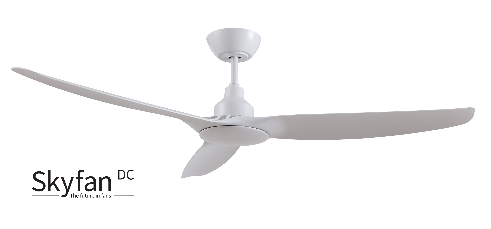

# Ventair Skyfan DC Ceiling Fan

Control your Skyfan DC Ceiling Fan from HomeKit.
- Turn on/off
- Set speed
- Set rotation direction
- Set light on/off
- Set light brightness

## Installation

Go to the Homebridge UI, Plugins screen and search for `homebridge-ventair-ceiling-fan`. Install the plugin and use the form to configure it.

## Configuration

Open the plugin settings in the Homebridge UI. Every fan already in your config is listed
there first — name, device ID, whether a local key is set, and its toggles — with no need
to open `config.json`. From there you can:

- **Scan** the network to find fans and badge each configured fan as found or not found
  (a fan is never removed automatically just because a scan missed it).
- **Paste a local key directly** into any fan — this always works and needs no cloud
  credentials.
- **Fetch keys from Tuya Cloud** using your Access ID/Secret, for one fan or all of them
  at once. Tuya time-limits how long an IoT-portal project can pull device data, so cloud
  fetch can eventually stop working for older projects — manual key entry is the
  supported fallback, not an afterthought.

To get your `Id` and `Key` the manual way, follow [Getting your keys](https://github.com/jasonacox/tinytuya/tree/master#setup-wizard---getting-local-keys).

## Matter (beta, opt-in)

Each fan can also be exposed as a Matter device, so non-Apple ecosystems can control it
alongside HomeKit. This requires Matter to already be enabled on your Homebridge bridge
(`bridge.matter` in your Homebridge config) — Matter support in Homebridge is itself beta.

Enable it per-fan with the "Expose to Matter" option in the plugin settings
(`exposeMatter`, off by default). If your bridge doesn't have Matter enabled, this option
has no effect and a warning is logged.

**Known limitation:** Matter's `FanControl` cluster has no rotation-direction attribute, so
reverse/forward rotation is only available through HomeKit, not through Matter.

## Thanks

- [tuyapi](https://github.com/codetheweb/tuyapi)
- @marsuboss
# homebridge-ventair-ceiling-fan
